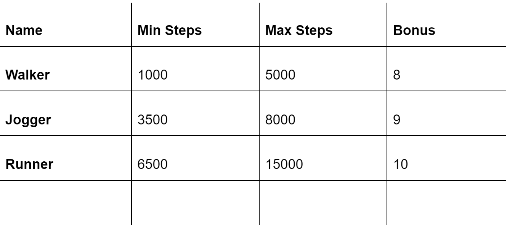

# 👟 STEPB SHOE DETAILS

Each day, you will have 40 minutes to use Move To Earn Feature.

HOW TO JOIN**:**\
**-** Step 1: Buy a Shoes Box in the marketplace\
\- Step 2: Open the Shoes Box and collect your NFT Sneakers\
\- Step 3: Select the proper shoes for your journey\
\- Step 4: Press Start\
\- Step 5: Finish and claim your rewards

\*NOTE: After you press Start, the app will start timing for at least the first 10 minutes. That means even if you just press start and turn off 5 minutes later, your running time will still be deducted by 10 minutes; you only have 30 minutes left. Movey rewards are affected by three main factors, namely Steps, Sneaker Types and Sneaker Rare. SNEAKER TYPES There are three Sneaker types, each designed to suit a different exercise intensity and/or fitness level:

**SNEAKER RARE**

Sneaker Rare is one of the main factors which decide how many tokens you may get. Sneaker rare level affects Sneaker Attributes, which are:

* Efficiency: determines the rate by which you will earn $STEPB tokens. Higher efficiency will result in more earnings.
* Durability: determines the rate of health decay of your sneaker. Higher durability will result in slower health decay. The higher the Sneaker's level or quality, the higher the repair cost.
* Luck: determines the frequency and quality of a Lucky Items drop.

When a Sneaker is minted, the value of Sneaker Attributes will be chosen at random within the min and max values according to Sneaker rare. Sneakers of the same rare may have vastly different Attribute. There are five Sneaker Rare Level: Common, Uncommon, Rare, Epic and Legendary corresponding with 5 levels.

.png>)

**SNEAKER STRUCTURE**

Each sneaker includes 6 main parts: toe, vamp, lacing, quarter, topline, sole and 2 additional parts for sneakers with high rare level: hypersolar stamp and mercurial stamp.

.png>)

**HOW TO CALCULATE THE REWARDS**

****

.png>)

\*X, Y: Constant Number set by Dev \
****\*Steps: number of steps that users can take within 40 minutes. \
\*Bonus: each sneaker type has a different bonus point. \
\*Efficiency, reliability: the higher the rare level is, the higher the efficiency and reliability are. \*Optimization Rate: the value will be 1 when the steps counted in 40 minutes are within the allowable range of each sneaker type. If the steps are under the minimum or over the maximum, the value will be gradually deducted.

**HOW TO MAXIMIZE THE REWARDS**

Based on the above formula, users can easily find out the way to maximize their rewards. One single factor can affect the reward value.\
\- Steps: the more steps you take, the higher rewards you get. However, they should not be over the limit stated for each sneaker type. In order to do that, remember to select a suitable sneaker type.\
****- Bonus: The bonus point is varied for each sneaker type. Specifically, the bonus will be 8, 9 and 10 for walker, jogger and runner sneaker in order. Pay attention to the steps in can take because if you cannot reach the minimum steps, the optimization rate will be deducted.\
\- Reliability: affected by durability. The higher the durability percentage is, the higher the reliability value is. With the durability of 100%, reliability value will be 1. It will be gradually deducted if durability decreases. When the percentage is 30 or under, the value will be zero, this means you will not get any rewards for your effort. Therefore, remember to check the durability of your sneakers before starting.

